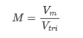

# Three Phase Inverter Simulation

I design a *Three Phase Inverter Simulation* by using simulink of matlab.  It is basically a design homework of my power electronic course. The **DC voltage input**, **switch frequency of carrier wave** and **active power output** are 710V, 14kHz and 11kW which are adopted based on my student ID numbers lol. The **sine wave frequency** is 50Hz and I use **resistive load(Y-floating style)** with 220V root mean square phase voltage output. I also design part to detect input waves, output waves( before filter and after) and THD measurement for phase to phase voltage. For the part of LC filter, I refer to some papers that suggest using these equations to acquire a desired value :

The ω~1~ is the frequency of the modulation sine wave, the ω~L~ is the Cut-off frequency, which I set it 1400Hz here. Note that they are Angular frequency so remember to multiply 2π.

and *C* goes like:

I use delta type connection to connect capacitors so the value for each capacitor is 1/3 of the C you get from above.

And to determine the *modulation index* :

> "Where *V~m~* is the control signal and *V~tri~* is the carrier signal."
>
> ​																				-- Mutasem, Ammar & Isaid, Karmel. (2017). Modeling of Three-phase SPWM Inverter. 10.13140/RG.2.2.13943.83366. 

which can be determined by :

